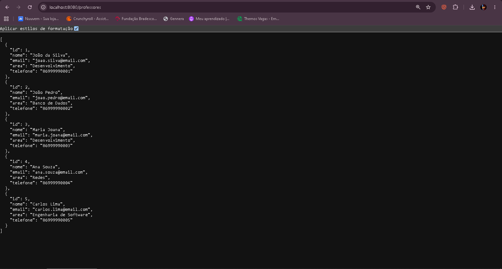
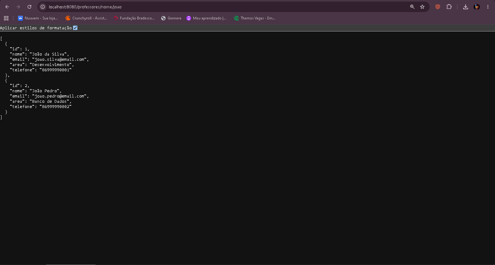
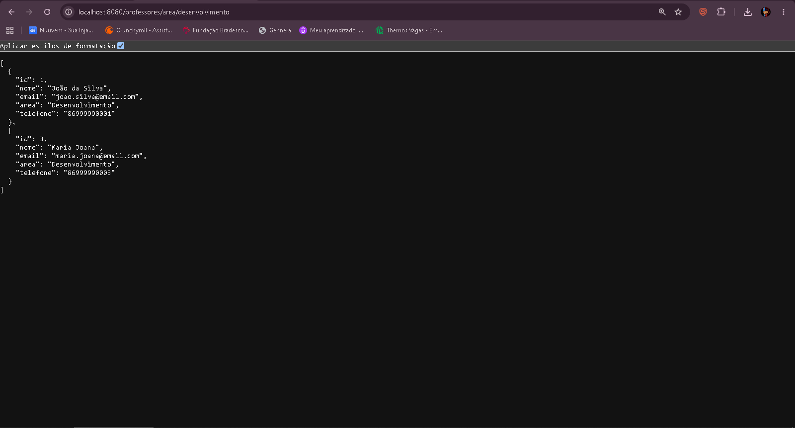
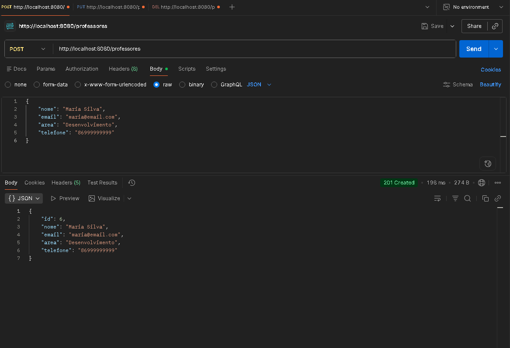
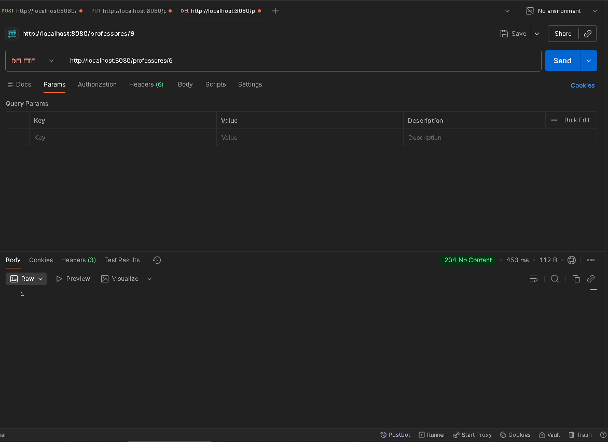

# API de Professores

## Identificação

- **Aluno:** _(Marcelo Sampaio)_
- **Disciplina:** _(Desenvolvimento BackEnd com Java)_
- **Descrição:** API REST para cadastro e gerenciamento de professores, com operações de CRUD e filtros por nome e por área, desenvolvida com Spring Boot, Spring Data JPA e PostgreSQL.

## Tecnologias utilizadas

- Java 17
- Spring Boot 3.3.5
- Spring Web
- Spring Data JPA
- PostgreSQL
- Maven

## Como executar

1. Instale Java 17+, Maven e PostgreSQL.
2. Crie o banco de dados:
   ```sql
   CREATE DATABASE escola;
   ```
3. cria a tabela `professor` e insere registros iniciais.
4. Ajuste usuário e senha do banco em `src/main/resources/application.properties`, se necessário.
5. Inicie a aplicação:
   ```bash
   mvn spring-boot:run
   ```
6. A API ficará disponível em `http://localhost:8080`.

## Estrutura

```
src/main/java/com/example/professores
├── controller
├── service
├── repository
└── model
```

## Endpoints

| Método | Endpoint | Descrição |
|--------|----------|-----------|
| GET | /professores | Lista todos |
| GET | /professores/nome/{nome} | Filtra por nome (parcial, case insensitive) |
| GET | /professores/area/{area} | Filtra por área (case insensitive) |
| POST | /professores | Cadastra professor |
| PUT | /professores/{id} | Edita professor |
| DELETE | /professores/{id} | Exclui professor |

Exemplo de corpo para POST/PUT:

```json
{
    "nome": "Maria Silva",
    "email": "maria@email.com",
    "area": "Desenvolvimento",
    "telefone": "86999999999"
}
```

## Evidências de execução

> Adicione aqui os prints dos testes (Postman/Insomnia) mostrando método, URL, dados enviados, status e resposta.

### Caso 1 — Listar professores (`GET /professores`)


### Caso 2 — Filtrar por nome (`GET /professores/nome/{nome}`)


### Caso 3 — Filtrar por área (`GET /professores/area/{area}`)


### Caso 4 — Cadastrar professor (`POST /professores`)


### Caso 5 — Editar professor (`PUT /professores/{id}`)


### Caso 6 — Excluir professor (`DELETE /professores/{id}`)

